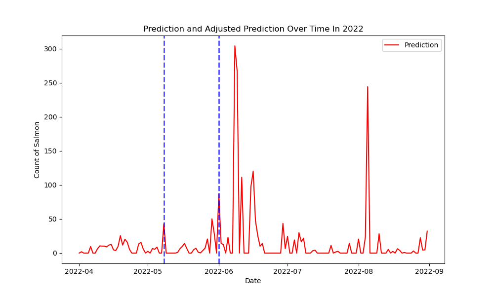

# Outmigration Prediction with XGBoost

## 0. Objective

Every year, the Pacific Salmon Foundation conducts field activity of tagging salmon. As a part of the data collection, tagging salmons is crucial to monitor salmons for the Bottleneck to Survival Analysis. Outmigration is when juvenile salmon move from their freshwater habitat to the ocean; the Pacific Salmon Foundation tags the salmon on their way to outmigration as a part of the tagging activities. With the timing of salmon outmigration varying every year, there have been times when biologists spend weeks waiting by rivers without any outmigration activities. To save time and resources, this model is developed to predict the outmigration timing of salmon. 

## 1. Folder Structure
```
- data
  |- raw             
  |- preprocessed 
- demo 
  |- demo.ipynb
- scripts
  |- outMigration_preprocessing.py
  |- outMigration_prediction.py         
```

Within this folder, users will find a few sub-folders as described in the table below. 
| Folder Name | Stored File Formats | Description |
| --- | --- | --- |
| Data | .csv | The data directory contains CSV files used for running the scripts stored in the scripts folder. This directory is divided into two sub-folders: `raw`, which stores data extracted from the Strait of Georgia Data Center, and `processed`, which stores preprocessed data generated after executing the `scripts/outMigration_preprocessing.R` script.|
| Scripts | .py | The scripts directory contains python scripts used for both preprocessing data and conducting outmigration prediction. These scripts include necessary steps to clean, transform, and predict outmigration timing. |
| Demo | .ipynb | The demo directory contains a notebook file of demonstrating how the functions should be used.|

## 2. Installation
### 2.1 Required Pakcages
```
pandas
numpy
scikit-learn
xgboost
matplotlib
pyarrow
```

### 2.2 Replicate this analysis 
#### 2.2.1 Clone this repository from GitHub:
```         
git clone https://github.com/brahmwg/Bottlenecks_MDS_Capstone.git 
```

#### 2.2.2 Create a conda environment:
```
conda env create -f environments/environment_ml.yml
```

#### 2.2.3 Activate the newly created conda environment:
```
conda activate mds_bottleneck
```

## 3. Running Scripts
### 3.1 Data preprocessing 
Data stored in the `data/raw` file is retrieved from multiple data sources stored in the Strait of Georgia Data Center. To transform the data into suitable format for modeling, first run the `outmigration_preprocessing.py` file. 

#### 3.1.1 Go to the scripts folder: 
```
cd /mds_deliverables/outMigration_model/scripts
```

#### 3.1.2 Run the preprocessing file: 
```
python outMigration_model_prediction.py 
```

After running the above command, the preprocessed file will be stored at the `data/preprocessed` folder as `preprocessed_ck.csv`. 

### 3.2 Predicting
After being prerocessed, the data can be used to predict outmigration date. 

#### 3.2.1 Run the prediction file: 
```
python outMigration_model_prediction.py 
```

#### 3.3 Outcome
After running the preprocessing and modeling files, the script will output a file of outmigration prediction with two blue lines indicating when the 5 to 10% of the salmons will outmigrate in 2022. 

After closing the picture, the terminal will return "5% to 10% of salmon are predicted to be tagged between: 2022-05-08 to 2022-06-01." 
